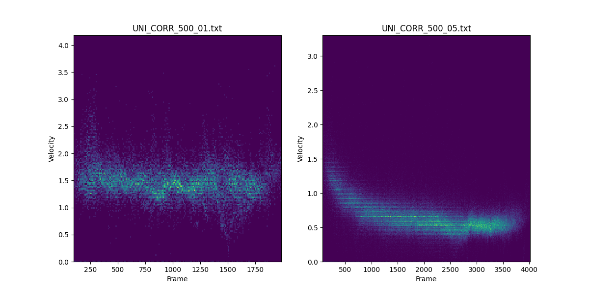
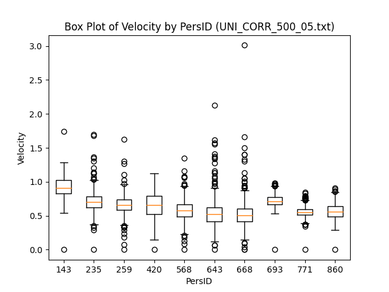

# Laboratorio 03: Análisis de Flujo Peatonal y Cálculo de Velocidad

## 1. Introducción

En este laboratorio, se aborda el análisis del flujo peatonal en un espacio público, específicamente en un pasillo de un metro. Se utilizan varios archivos de texto que contienen datos relevantes sobre las personas detectadas, incluyendo su ID, el frame del video en el que aparecen y sus coordenadas (x, y, z) en un espacio tridimensional. El objetivo es procesar estos datos para calcular la velocidad peatonal en diferentes áreas y analizar su comportamiento.

### 1.1 Justificación

El análisis del flujo peatonal es esencial para la gestión eficiente de espacios públicos y el diseño de infraestructuras adecuadas. Comprender cómo se mueven las personas en áreas determinadas permite tomar decisiones informadas para mejorar la experiencia de los usuarios y optimizar la planificación urbana.

### 1.3 Objetivos

**Objetivo General**

- Analizar y calcular, la frecuencia y velocidad peatonal en un espacio público utilizando datos de coordenadas proporcionados en un archivo de texto.

**Objetivos específicos**

1. Extraer y almacenar las coordenadas (x, y, z) de las personas del archivo de texto en una estructura de datos.
2. Obtener la velocidad que tiene cada individuo por Frame.
3. Mostrar un gráfico por pantalla el cual muestra la velocidad promedio de la multitud, para un determinado frame.
4. Implementar el módulo `velocity_module`, que proporciona funciones para calcular la velocidad de los peatones, generar visualizaciones y obtener información de recursos durante la ejecución.

## 2. Marco teórico

En este laboratorio, utilizaremos las siguientes herramientas y librerías:

- Python: Lenguaje de programación para el procesamiento de datos y cálculos matemáticos.
- NumPy: Librería para la manipulación y operación de arreglos numéricos.
- Matplotlib: Librería para la visualización de datos en gráficos y figuras.
- Pandas: Librería para el análisis y manipulación de datos tabulares.
- Math: Librería para cálculos y operaciones.
- psutil: Librería para obtener información sobre el uso de recursos del sistema.

## 3. Materiales y métodos

### Dataset

Se utilizarán dos archivos de texto que contienen información sobre el flujo peatonal en un pasillo del tren subterráneo. Cada línea del archivo incluye el ID de la persona, el frame del video y las coordenadas (x, y, z).

### Procedimiento

1. Leer y procesar el archivo de texto para obtener las coordenadas (x, y, z) de cada persona.
2. Calcular la velocidad de las personas a lo largo del frame para obtener posteriormente la velocidad promedio de la multitud.
3. Visualizar por pantalla la velocidad promedio que hay por frame.
4. Utilizar el módulo `velocity_module` para automatizar el cálculo de velocidad, generar gráficos y obtener información de recursos.
5. Utilizar las funciones `compare_histograms` y `show_box_plot` para comparar y visualizar histogramas y diagramas de caja de velocidades respectivamente.

## 4. Resultados obtenidos

En este laboratorio, a través de la lectura de archivos y el cálculo de velocidades por persona, se lograron obtener las siguientes velocidades de la multitud:

La visualización final muestra la velocidad peatonal, lo que proporciona una visión clara y detallada del flujo de personas en el espacio público. Además, con la implementación del módulo `velocity_module`, se facilitó la automatización de cálculos y la generación de visualizaciones.

## 5. Conclusiones

`velocity_module` es una potente herramienta desarrollada en este laboratorio para visualizar el comportamiento de las velocidades de los peatones en multitudes. Esta incorporación agiliza el análisis y ofrece una solución completa para el cálculo y la representación visual de las velocidades peatonales en función de los datos proporcionados en los archivos de texto. Las funciones adicionales `compare_histograms` y `show_box_plot` amplían las opciones de análisis y visualización para una comprensión más profunda del flujo peatonal.

