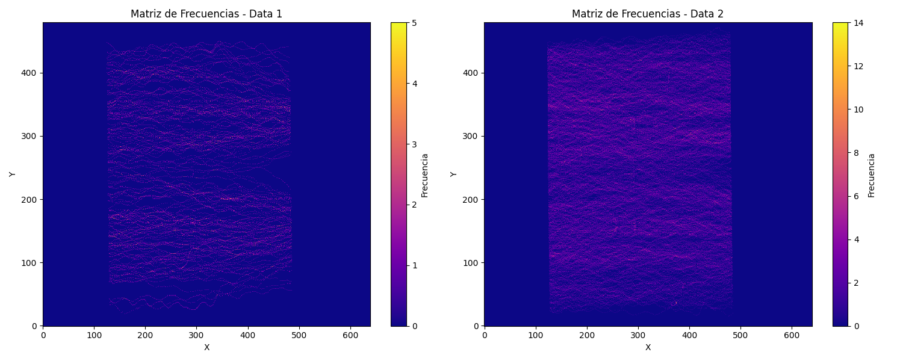
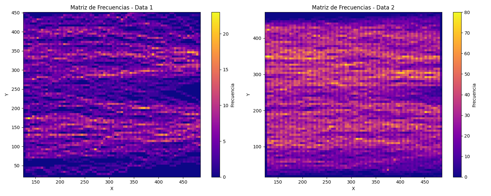
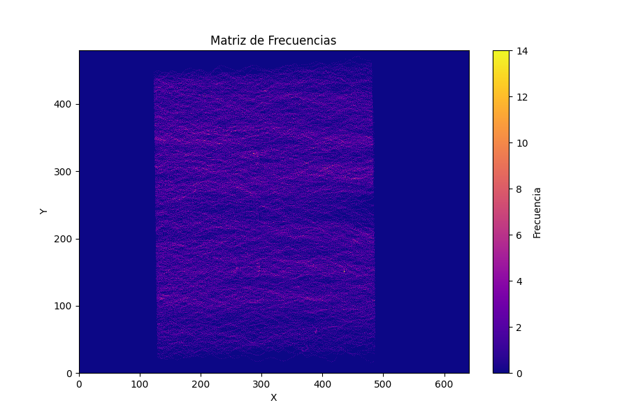
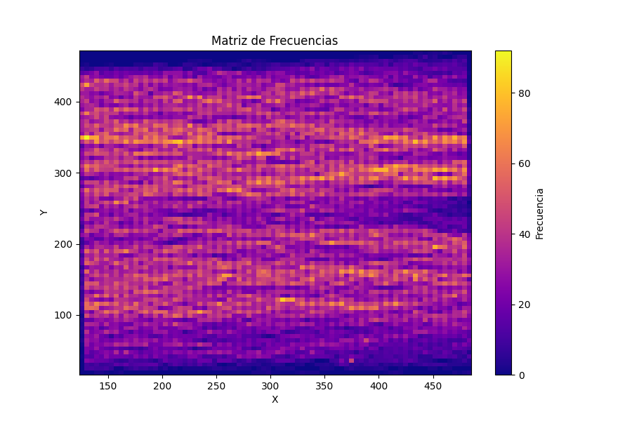

# Laboratorio 02: Análisis de Flujo Peatonal y Cálculo de Frecuencia

## 1. Introducción 

En este laboratorio, se aborda el análisis del flujo peatonal en un espacio público, específicamente en un pasillo de un metro. Se utilizan dos archivos de texto que contienen datos relevantes sobre las personas detectadas, incluyendo su ID, el frame del video en el que aparecen y sus coordenadas (x, y, z) en un espacio tridimensional. El objetivo es procesar estos datos para calcular la frecuencia peatonal en diferentes áreas y analizar su comportamiento.

### 1.1 Justificación

El análisis del flujo peatonal es esencial para la gestión eficiente de espacios públicos y el diseño de infraestructuras adecuadas. Comprender cómo se mueven las personas en áreas determinadas permite tomar decisiones informadas para mejorar la experiencia de los usuarios y optimizar la planificación urbana.

### 1.3 Objetivos 

**Objetivo General**

- Analizar y calcular la frecuencia peatonal en un espacio público utilizando datos de coordenadas proporcionados en un archivo de texto.

**Objetivos específicos**

1. Extraer y almacenar las coordenadas (x, y, z) de las personas del archivo de texto en una estructura de datos.
2. Calcular la matriz de frecuencia para cada conjunto de datos de coordenadas.
3. Comparar las matrices de frecuencia generadas por diferentes enfoques.
4. Mezclar las matrices de frecuencia y visualizar la frecuencia peatonal en un mapa de calor.

## 2. Marco teórico

En este laboratorio, utilizaremos las siguientes herramientas y librerías:

- Python: Lenguaje de programación para el procesamiento de datos y cálculos matemáticos.
- NumPy: Librería para la manipulación y operación de arreglos numéricos.
- Matplotlib: Librería para la visualización de datos en gráficos y figuras.
- Pandas: Librería para el análisis y manipulación de datos tabulares.

## 3. Materiales y métodos

### Dataset

Se utilizará un archivo de texto que contiene información sobre el flujo peatonal en un pasillo del tren subterráneo. Cada línea del archivo incluye el ID de la persona, el frame del video y las coordenadas (x, y, z).

### Procedimiento

1. Leer y procesar el archivo de texto para obtener las coordenadas (x, y, z) de cada persona.
2. Calcular la matriz de frecuencia para cada conjunto de coordenadas.
3. Comparar las matrices de frecuencia generadas por diferentes enfoques (sin y con Pandas).
4. Mezclar las matrices de frecuencia para obtener una sola matriz combinada.
5. Visualizar la frecuencia peatonal en un mapa de calor.

## 4. Resultados obtenidos

En este laboratorio, se implementaron dos enfoques diferentes para calcular la frecuencia peatonal, uno utilizando únicamente NumPy y Matplotlib, y otro aprovechando la librería Pandas. A continuación, se presentan los resultados de ambos enfoques:

| Enfoque     | Tiempo de ejecución (segundos) | Uso de memoria virtual (MB) |
|-------------|--------------------------------|-----------------------------|
| Sin Pandas  | 0.811218                       | 89.6                        |
| Con Pandas  | 1.452615                       | 105.5                       |

La visualización final muestra la frecuencia peatonal en un mapa de calor, lo que proporciona una visión clara y detallada del flujo de personas en el espacio público.

## 5. Conclusiones

El análisis del flujo peatonal es esencial para la planificación urbana y la mejora de la experiencia de los usuarios en espacios públicos. Al implementar diferentes enfoques utilizando NumPy y Pandas, se ha demostrado la importancia de elegir las herramientas adecuadas para el procesamiento y análisis de datos. La visualización de la frecuencia peatonal en un mapa de calor brinda información valiosa para la toma de decisiones informadas en la gestión de espacios públicos.

La matriz de frecuencia generada por el programa se ha almacenado en el archivo "frequency_matrix.txt" en la carpeta "src", y está lista para su análisis posterior.
